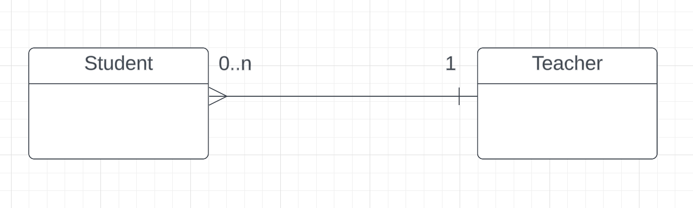
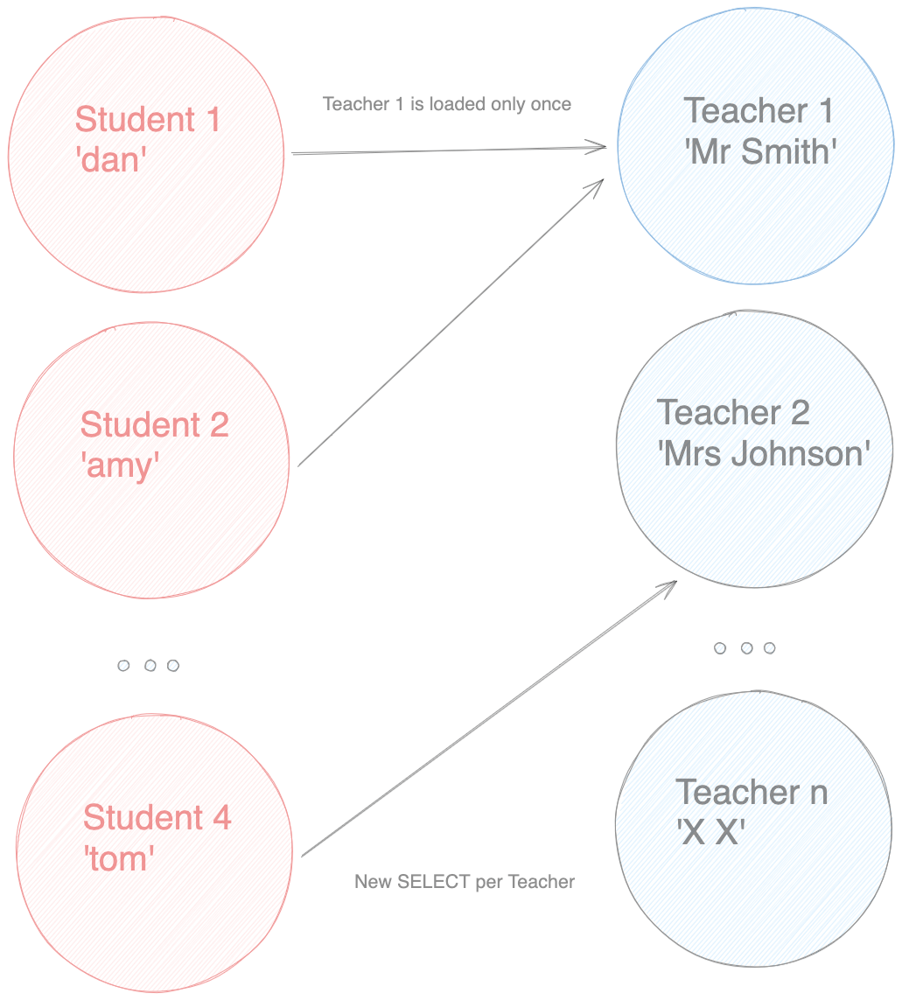

### Project Setup

Our UML diagram consist of a simple `ManyToOne` relationship between a **Student** and a **Teacher**.


#### Student entity

```
@Entity
@Table(name = "students")
public class Student {
    @Id
    @GeneratedValue(strategy = GenerationType.IDENTITY)
    private UUID id;
    
    private String name;
    
    @ManyToOne
    private Teacher teacher;
}   

```

#### Teacher entity

```
@Entity
@Table(name = "teachers")
public class Teacher {
    @Id
    @GeneratedValue(strategy = GenerationType.IDENTITY)
    private int id;
    
    private String name;
    private String department;
    
    @OneToMany(mappedBy = "teacher")
    private List<Student> students;
}
```

#### Mock data

```
INSERT INTO teachers (id, name, department)
VALUES (1, 'Mr Smith', 'Arts'),
       (2, 'Mrs Johnson', 'Math');

INSERT INTO students (id, name, teacher_id)
VALUES (1, 'dan', 1),
       (2, 'amy', 1),
       (3, 'mia', 1),  
       (4, 'tom', 2),
       (5, 'john', 2),
       (6, 'lia', 2);
```

### The Problem

By default, Hibernate will **EAGER** fetch any single valued relationships. Therefore, when running below code that
loads all students, Hibernate will fist generate a query that fetches all students then for
each student it will generate new query to fetch the relevant teacher.

```
   em.createQuery("SELECT s from Student s", Student.class);
```

#### Output

```
# (1) load all students
Hibernate:
    select
        s1_0.id,
        s1_0.name,
        s1_0.teacher_id 
    from
        students s1_0
        
# (2) load each teacher
Hibernate: 
    select
        t1_0.id,
        t1_0.department,
        t1_0.name 
    from
        teachers t1_0 
    where
        t1_0.id=?
Hibernate: 
    select
        t1_0.id,
        t1_0.department,
        t1_0.name 
    from
        teachers t1_0 
    where
        t1_0.id=?
```

Luckily Hibernate only generated 2 additional queries to load the teachers (due to caching) as all students are equally
distributed between just two teachers. However, this can still lead to unexpected performance issues as we would have
fetched **all** other Student dependencies annotated with `@ManyToOne`, resulting in a larger object-graph traversal
with huge final being dataset generated which might not be needed in the current context.

I also drew a simple object-graph for the more visual learners out there 😊



This is known as
the [N + 1 Select Problem](https://stackoverflow.com/questions/97197/what-is-the-n1-selects-problem-in-orm-object-relational-mapping) -
one `SELECT` for the parent
object and a further `SELECT` for each child object.

### Mitigation Option 1

You can switch off the default `EAGER` fetch behavior by changing it to `LAZY` the default for collections. This will
give as a Proxy object for
the Teacher and only whenever we access any of its methods the real entity will be loaded via a `SELECT` query.

```
  @ManyToOne(fetch = FetchType.LAZY)
  private Teacher teacher;
```

This is applicable in situations where we are only interested in the parent object (student) and do not plan on working
with any child objects (teacher).

### Mitigation Option 2

You can specify `LEFT JOIN FETCH` in your query and load all students and teachers together on one go.

```
   em.createQuery("""SELECT s from Student s
                     LEFT JOIN FETCH s.teacher""", Student.class);
```

Hibernate will generate the following query.

```
Hibernate: 
    select
        s1_0.id,
        s1_0.name,
        t1_0.id,
        t1_0.department,
        t1_0.name 
    from
        students s1_0 
    left join
        teachers t1_0 
            on t1_0.id=s1_0.teacher_id
```

So far the options we've seen are kind of in the extreme - [Option 1](#mitigation-option-1) uses large number of 
small queries to load the
data which can add up on processing time and [Option 2](#mitigation-option-2) have one giant query that loads excessive data and can stuck 
the database while processing.

Next option falls somewhere in the middle of its predecessors. It is however considered advanced topic and I will
not go into much detail since it's not part of the JPA standard but entirely a Hibernate feature.

### BATCH FETCHING

To start off we need override the default **EAGER** fetch behavior to **LAZY** as discussed
in [Option 1](#mitigation-option-1).  
Then add `@BatchSize` (org.hibernate.annotations.BatchSize) to the target entity and give its `size` parameter
a number of entities you would like to load.

```
import org.hibernate.annotations.BatchSize;

@Entity
@Table(name = "teachers")
@BatchSize(size = 10)
public class Teacher {...}
```

And Hibernate will generate the following query.

```
Hibernate: 
    select
        t1_0.id,
        t1_0.department,
        t1_0.name 
    from
        teachers t1_0 
    where
        t1_0.id in (?, ?, ?, ?, ?, ?, ?, ?, ?, ?)
```

What happens here is that once we target the Proxy (teacher) object not just one entity but as many
as we specified in the "size" parameter will be loaded.

### Summary

Since each option has its trade-offs my biggest advice would be to enable Hibernate logging in your **persistence.
xml** and carefully expect the queries that are being generated and tweak the application code to match you needs.

```
<property name="hibernate.show_sql" value="true"/>
<property name="hibernate.format_sql" value="true"/>
```
Thanks for reading.