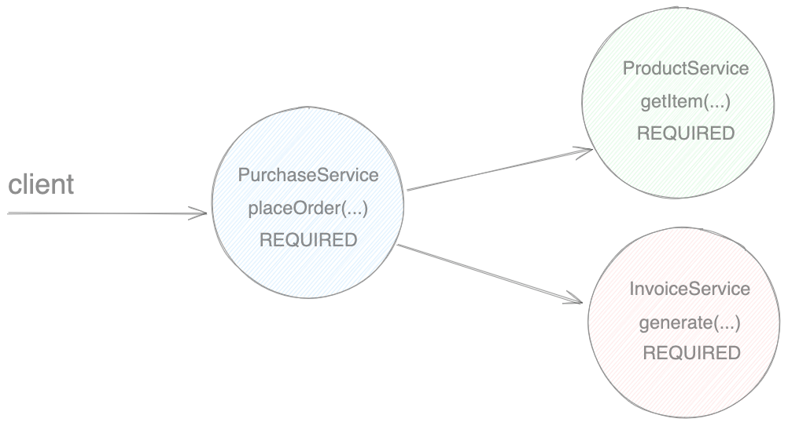
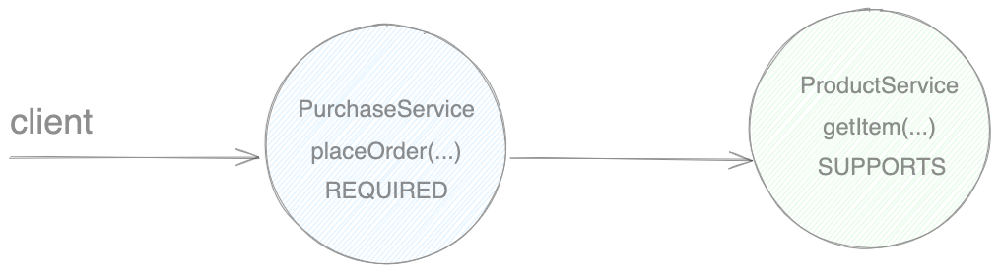
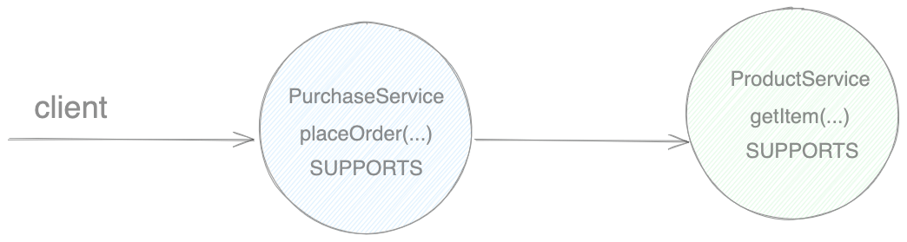

We would normally want to wrap the business layer methods in a transaction as we want clients to be able to execute one
whole unit of work for the given domain or rollback if something goes wrong. For that reason we should think of
transactions being *Application Transactions* rather than Database and annotated the business services with
`@Transactional`.  

The questions we need to ask is what should happen when we have one or more child methods wrapped in a transaction that 
are part of a bigger parent method which is also transactional - should they propagate or silently merge?

There are 7 available options for configuring child methods transaction propagation in Spring applications which are 
all inherited from JavaEE standard and can be applied as follows `@Transactional(propagation = Propagation.REQUIRED)`, **REQUIRED**
being the default option.

1. REQUIRED
2. SUPPORTS 
3. NOT_SUPPORTED
4. REQUIRES_NEW
5. NEVER
6. MANDATORY
7. NESTED

### 1. REQUIRED

In below example we have a `placeOrder` parent method that delegates the ordering of an item to 2 other services 
**ProductService** and **InvoiceService** and their child methods `getItem` and `generate` respectively.

> The child method requires a transaction but can join in a parent's existing transaction if one exists.

### 2. SUPPORTS

Whenever a particular method or an entire service doesn't need to be transactional and work in memory only.

Transaction for the parent method is created however no changes to DB when the child method is running.

No transaction created.

> Don't bother creating a new transaction - but I wouldn't mind if there is already an existing one.

### 3. NOT_SUPPORTED

As soon as we enter the child method with NOT_SUPPORTED propagation option an existing parent transaction will be 
suspended for the duration of the child method. By suspend I mean that the child method will run on a different 
thread from the parent method and therefore would ignore the transaction overall.

Can be used for DDL operations as 
some Databases does not allow it during a transaction.
> Definitely do NOT want a transaction for the duration of this method call.

### 4. REQUIRES_NEW

Will create a brand new transaction for the duration of the child method however it will also suspend the parent 
transaction for the time being. This can cause issues when the parent method has to **rollback** but the child 
method has already committed. Can be used for Auditing, Logging.

> Brand-new transaction, completely isolated from the parent's transaction that needs to be committed immediately.

### 5. NEVER

> Will throw an exception whenever the  method is called within an open (parent) transaction.

### 6. MANDATORY

Can be used to force the client to use a transaction.

> Will throw an exception when method is called and there is NO transaction currently open.

### 6. NESTED
> Sets a savepoint at the start of the method. If the method rollbacks the savepoint is restored and the parent 
> continues. If the parent rollbacks the child will as well.